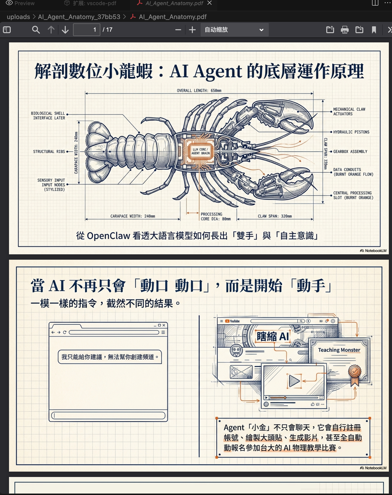
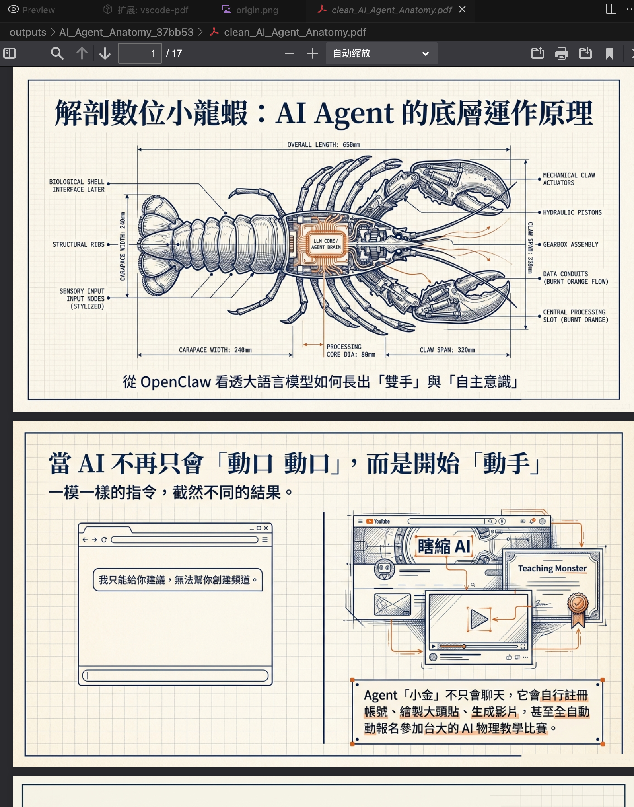
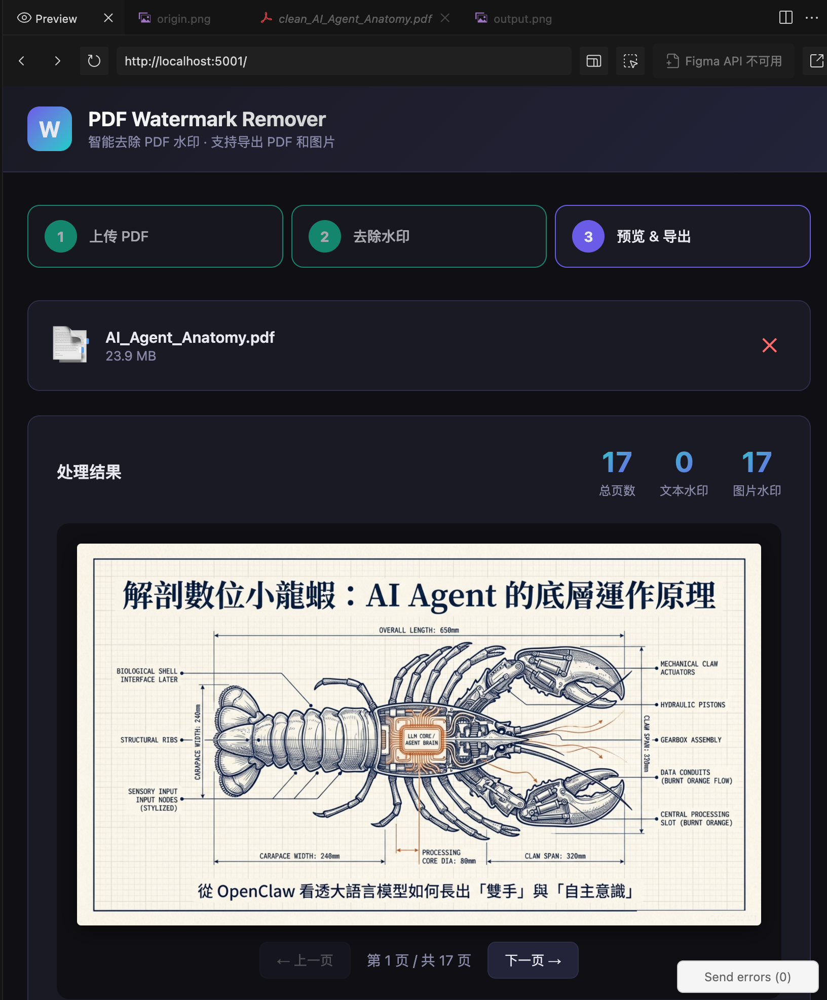
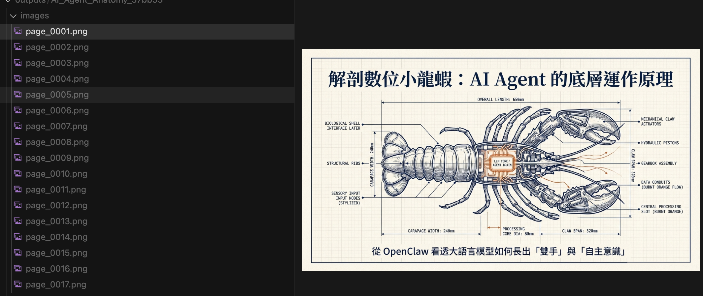

# NotebookLM Watermark Remover

> 专为 **NotebookLM** 导出 PDF 设计的水印去除工具。自动识别并清除每页右下角的 `🎙 NotebookLM` 品牌水印，支持批量处理、逐页预览，导出干净的 PDF、每页图片或拼接长图。

## 效果展示

### 去水印前后对比

| 原始文件（含水印） | 处理后（水印已去除） |
|:-:|:-:|
|  |  |

> 示例为 NotebookLM 导出的图片型 PDF，右下角带有 `🎙 NotebookLM` 水印徽标，处理后水印被完整清除，内容不受影响。

### Web UI 界面



全新品牌化界面，专为 NotebookLM 用户设计：

- **Hero 区域** — 突出 NotebookLM 品牌定位，展示「水印 → 已清除」视觉对比
- **水印说明条** — 直观展示 `🎙 NotebookLM` → `✓ 已清除` 的处理效果
- **三步流程** — 上传 PDF → 去除水印 → 预览 & 导出
- **实时统计** — 显示处理页数、文本水印数、图片水印数

### 导出每页为图片



处理完成后可将 PDF 每页导出为独立图片（PNG/JPG），ZIP 打包下载，DPI 可选。

---

## 功能

- **像素级水印清除** — 针对每页为整张图片的 PDF（NotebookLM、Google Slides 导出等），精准覆盖水印像素
- **结构层水印清除** — 针对含文本/图片对象的传统 PDF，通过关键词 + 评分机制精准定位水印
- **Web UI** — 拖放上传、灵敏度可调、逐页预览，本地处理不上传服务器
- **导出 PDF** — 下载去水印后的完整 PDF 文件
- **导出图片** — 每页导出一张图片（PNG/JPG），DPI 可选，ZIP 打包下载
- **导出长图** — 将所有页面按顺序垂直拼接为一张长图，支持 PNG/JPG 格式
- **多语言界面** — 支持 8 种语言，右上角下拉切换，即时生效

## 快速开始

### 1. 安装依赖

```bash
pip install -r requirements.txt
```

### 2. 启动服务

```bash
python app.py
```

访问 http://127.0.0.1:5000

### 3. 使用步骤

1. 拖放或点击上传 NotebookLM 导出的 PDF 文件（最大 100MB）
2. 选择检测灵敏度（低 / 中 / 高），推荐默认「中」
3. 点击「开始去除水印」
4. 预览结果，翻页浏览确认效果
5. 导出 PDF、每页图片或拼接长图

## 项目结构

```
├── app.py                 # Flask 后端 + WatermarkRemover 引擎
├── templates/
│   └── index.html         # Web 前端 UI（品牌化设计 + i18n 多语言）
├── requirements.txt       # Python 依赖
├── image/                 # README 示例图片
├── uploads/               # 上传文件目录（运行时生成，按文件名命名）
└── outputs/               # 处理结果目录（运行时生成，按文件名命名）
```

## 技术栈

| 组件 | 技术 |
|------|------|
| 后端 | Python + Flask |
| PDF 引擎 | PyMuPDF (fitz) |
| 图像处理 | Pillow + NumPy |
| 前端 | 原生 HTML/CSS/JS，暗色主题，内置 i18n |

## 核心算法

### 图片型 PDF（如 NotebookLM 导出）

1. **类型检测** — 前 3 页无文本且有图片 → 识别为图片型 PDF
2. **逐页扫描** — 右下角 30px × 250px 区域定位水印
3. **智能背景采样** — 找区域内前景最少的 5 行取中位色作为背景基准
4. **前景覆盖** — 低阈值（diff > 8）检测所有非背景像素
5. **平滑过渡** — 膨胀 3px + 高斯模糊 1px 边缘过渡，避免留下修复痕迹
6. **写回 PDF** — `page.replace_image()` 替换原始图片数据

### 结构型 PDF

1. **品牌关键词命中** — NotebookLM 等直接判定
2. **综合评分** — 关键词、颜色、字号多维度打分
3. **Redaction 覆盖** — 使用 PDF redaction annotation 彻底删除水印对象

## 灵敏度说明

| 等级 | 说明 |
|------|------|
| 低（low） | 仅去除明显水印，误删风险最低 |
| 中（medium） | 推荐，平衡效果与安全 |
| 高（high） | 激进去除，可能误删部分浅色内容 |

## 多语言支持

右上角下拉菜单即时切换，支持以下语言：

| 语言 | 代码 |
|------|------|
| 🇨🇳 中文简体 | zh |
| 🇺🇸 English | en |
| 🇯🇵 日本語 | ja |
| 🇰🇷 한국어 | ko |
| 🇪🇸 Español | es |
| 🇫🇷 Français | fr |
| 🇩🇪 Deutsch | de |
| 🇧🇷 Português | pt |

## API 接口

| 方法 | 路径 | 说明 |
|------|------|------|
| POST | `/api/upload` | 上传 PDF 文件 |
| POST | `/api/process` | 处理去水印（参数：task_id, filename, sensitivity） |
| GET | `/api/preview/{task_id}/{page_num}` | 预览指定页面 |
| GET | `/api/page_count/{task_id}` | 获取总页数 |
| GET | `/api/export/pdf/{task_id}` | 下载去水印 PDF |
| GET | `/api/export/images/{task_id}` | 下载每页图片 ZIP（参数：dpi, format） |
| GET | `/api/export/longimage/{task_id}` | 下载长图（参数：dpi, format） |

## 更新日志

### v1.3.0
- **重设计** 界面全面品牌化，突出 NotebookLM 定位
  - Hero 区：「NotebookLM 水印一键清除」大标题 + 功能 chip 卡片
  - 水印说明条：直观展示 `🎙 NotebookLM → ✓ 已清除` 对比效果
  - 上传区标注「✓ 支持 NotebookLM PDF」徽标
  - 更深的背景色与蓝紫渐变视觉风格

### v1.2.0
- **新增** 导出长图功能：将所有页面按顺序垂直拼接为一张完整长图
- **新增** 多语言支持：8 种语言（中、英、日、韩、西、法、德、葡），右上角下拉切换
- **优化** 文件夹命名：`uploads/` 和 `outputs/` 目录改为以上传文件名命名（格式：`{文件名}_{6位ID}`）

### v1.1.0
- **修复** 水印去除不彻底：改进前景检测阈值（diff > 8）和背景采样策略
- **修复** 覆盖范围过大误伤正文：智能背景采样找区域内最空白行，精确定位水印

### v1.0.0
- 初始版本：像素级水印清除 + 结构层水印清除 + Web UI

## 依赖

```
flask==3.1.0
PyMuPDF==1.25.3
Pillow==11.1.0
gunicorn==23.0.0
```

## License

MIT


## 快速开始

### 1. 安装依赖

```bash
pip install -r requirements.txt
```

### 2. 启动服务

```bash
python app.py
```

访问 http://127.0.0.1:5000

### 3. 使用步骤

1. 拖放或点击上传 PDF 文件（最大 100MB）
2. 选择检测灵敏度（低 / 中 / 高）
3. 点击「开始去除水印」
4. 预览结果，翻页浏览
5. 导出 PDF、每页图片或长图

## 项目结构

```
├── app.py                 # Flask 后端 + WatermarkRemover 引擎
├── templates/
│   └── index.html         # Web 前端 UI（含 i18n 多语言）
├── requirements.txt       # Python 依赖
├── image/                 # README 示例图片
├── uploads/               # 上传文件目录（运行时生成，按文件名命名）
└── outputs/               # 处理结果目录（运行时生成，按文件名命名）
```

## 技术栈

| 组件 | 技术 |
|------|------|
| 后端 | Python + Flask |
| PDF 引擎 | PyMuPDF (fitz) |
| 图像处理 | Pillow + NumPy |
| 前端 | 原生 HTML/CSS/JS，暗色主题，内置 i18n |

## 核心算法

### 图片型 PDF（如 NotebookLM 导出）

1. **类型检测** — 前 3 页无文本且有图片 → 识别为图片型 PDF
2. **逐页扫描** — 右下角 30px × 250px 区域定位水印
3. **智能背景采样** — 找区域内前景最少的 5 行取中位色作为背景基准
4. **前景覆盖** — 低阈值（diff > 8）检测所有非背景像素
5. **平滑过渡** — 膨胀 3px + 高斯模糊 1px 边缘过渡，避免留下修复痕迹
6. **写回 PDF** — `page.replace_image()` 替换原始图片数据

### 结构型 PDF

1. **品牌关键词命中** — NotebookLM 等直接判定
2. **综合评分** — 关键词、颜色、字号多维度打分
3. **Redaction 覆盖** — 使用 PDF redaction annotation 彻底删除水印对象

## 灵敏度说明

| 等级 | 说明 |
|------|------|
| 低（low） | 仅去除明显水印，误删风险最低 |
| 中（medium） | 推荐，平衡效果与安全 |
| 高（high） | 激进去除，可能误删部分浅色内容 |

## 多语言支持

右上角下拉菜单即时切换，支持以下语言：

| 语言 | 代码 |
|------|------|
| 🇨🇳 中文简体 | zh |
| 🇺🇸 English | en |
| 🇯🇵 日本語 | ja |
| 🇰🇷 한국어 | ko |
| 🇪🇸 Español | es |
| 🇫🇷 Français | fr |
| 🇩🇪 Deutsch | de |
| 🇧🇷 Português | pt |

## API 接口

| 方法 | 路径 | 说明 |
|------|------|------|
| POST | `/api/upload` | 上传 PDF 文件 |
| POST | `/api/process` | 处理去水印（参数：task_id, filename, sensitivity） |
| GET | `/api/preview/{task_id}/{page_num}` | 预览指定页面 |
| GET | `/api/page_count/{task_id}` | 获取总页数 |
| GET | `/api/export/pdf/{task_id}` | 下载去水印 PDF |
| GET | `/api/export/images/{task_id}` | 下载每页图片 ZIP（参数：dpi, format） |
| GET | `/api/export/longimage/{task_id}` | 下载长图（参数：dpi, format） |

## 更新日志

### v1.2.0
- **新增** 导出长图功能：将所有页面按顺序垂直拼接为一张完整长图
- **新增** 多语言支持：8 种语言（中、英、日、韩、西、法、德、葡），右上角下拉切换
- **优化** 文件夹命名：`uploads/` 和 `outputs/` 目录改为以上传文件名命名（格式：`{文件名}_{6位ID}`），方便识别

### v1.1.0
- **修复** 水印去除不彻底：改进前景检测阈值（diff > 8）和背景采样策略
- **修复** 覆盖范围过大误伤正文：智能背景采样找区域内最空白行，精确定位水印

### v1.0.0
- 初始版本：像素级水印清除 + 结构层水印清除 + Web UI

## 依赖

```
flask==3.1.0
PyMuPDF==1.25.3
Pillow==11.1.0
gunicorn==23.0.0
```

## License

MIT

